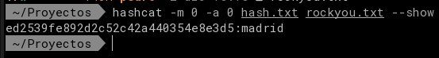

# practica 10.3 Hashcat

# Actividad 10.3

Hashcat es una herramienta avanzada de recuperación de contraseñas que utiliza técnicas de fuerza bruta y ataques de diccionario para descifrar hashes. En mi caso podre usar la GPU de mi portatil.

Para esta practica he generado mi propio hash de `madrid:ed2539fe892d2c52c42a440354e8e3d5`


## Paso 1.- Identifica el tipo de hash utilizando hash-identifier

Para determinar el algoritmo utilizado en la cadena `ed2539fe892d2c52c42a440354e8e3d5`, se emplea la herramienta `hash-identifier`. Esta utilidad analiza la longitud y el formato de la cadena hexadecimal para sugerir el tipo de hash más probable.

**Ejecución:**

```bash
hash-identifier
```

Al introducir el hash cuando se solicita, el sistema devuelve los resultados más probables. Dado que es una cadena de 32 caracteres hexadecimales, el resultado principal será **MD5**.


*Nota: El hash corresponde a la cadena de texto "madrid".*


-----

### Paso 2.- Descifra el hash con HashCat

Hashcat se utiliza para recuperar la contraseña mediante fuerza bruta o ataques de diccionario, aprovechando la potencia de la GPU para acelerar el proceso. Aunque puede ejecutarse en CPU, el rendimiento es significativamente menor.

Es mi equipo y con el puedo hacer lo que quiera.

**Sintaxis del comando:**

```bash
hashcat -m 0 -a 3 ed2539fe892d2c52c42a440354e8e3d5
```


**Explicación de parámetros:**

  * **`hashcat`**: Ejecutable de la herramienta.
  * **`-m 0`**: Especifica el tipo de hash (Mode). El modo `0` corresponde a **MD5**, identificado en el paso anterior. Hashcat soporta una amplia gama de algoritmos.
  * **`-a 3`**: Define el modo de ataque (Attack Mode). Se selecciona **Brute-Force** (Fuerza bruta con máscara).
  * **`ed2...3d5`**: El hash objetivo a descifrar.

**Salida exitosa:**
Tras la ejecución, Hashcat mostrará el estado `Cracked` y la cadena en texto plano:
`ed2539fe892d2c52c42a440354e8e3d5:madrid`

Si se utilizara un archivo de diccionario (ej. `rockyou.txt`) en lugar de fuerza bruta pura, el comando cambiaría el modo de ataque a `-a 0`:

```bash
hashcat -m 0 -a 0 hash.txt /Proyectos/rockyou.txt
```

El resultado final:


